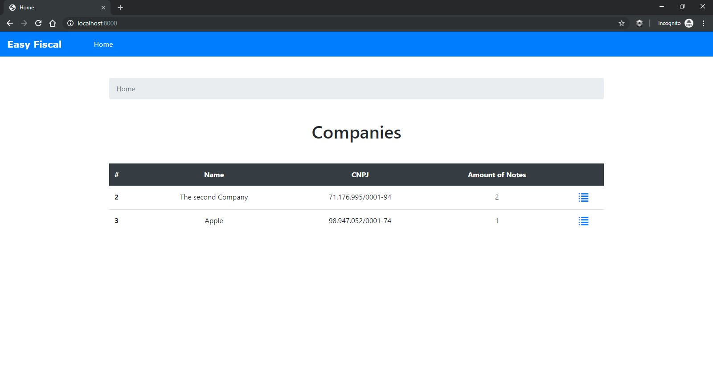
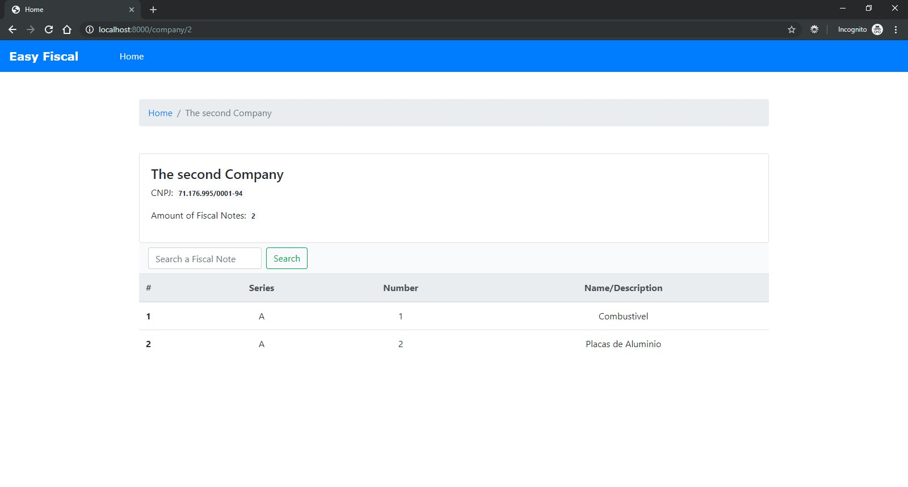
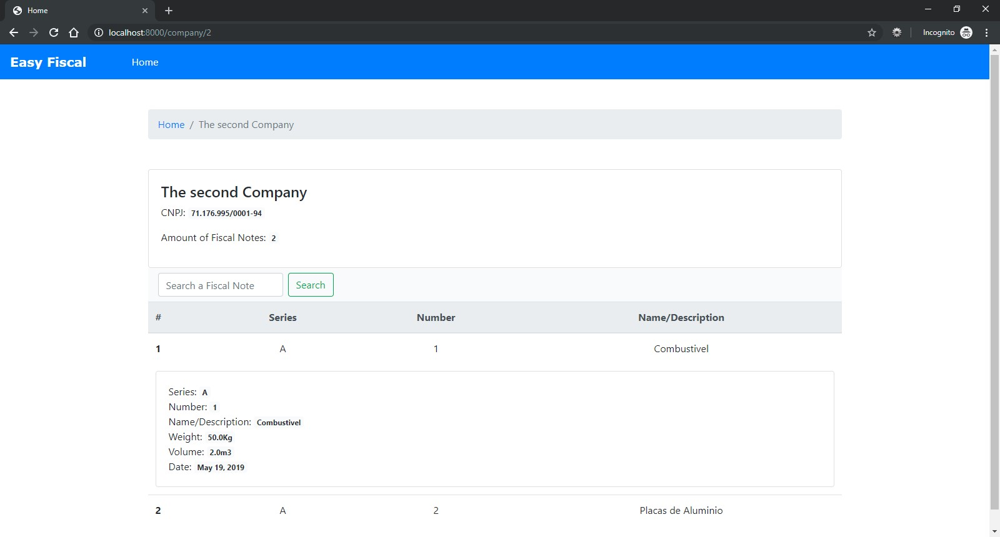
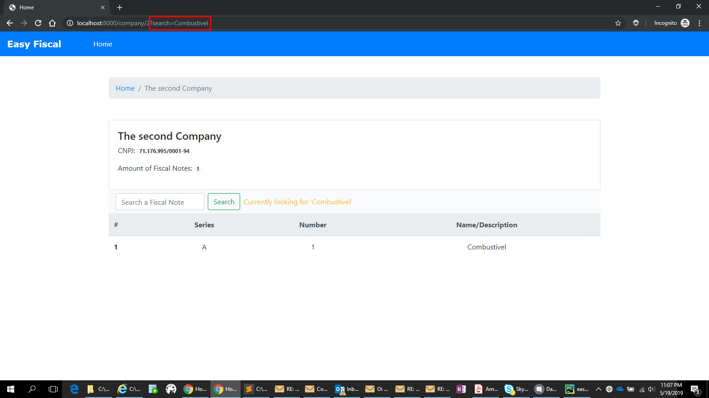

[](https://circleci.com/gh/fabinhojorge/easyfiscalnote)

# Easy Fiscal Note
This is a simple project to test Django and integration with CI.
There are basically 2 simple models: Company and FiscalNote
The idea here is to create a simple list screen for this models.

## How to install and Run

After activate your Python Virtual Environment (_venv_) run the below command:

```
pip install -r requirements.txt

python manage.py migrate

python manage.py runserver
```

So you can access in the local URL: _[localhost:8000](localhost:8000/)_


## Initial Data
There are 2 options to install the initial data:

1- Using fixture
```
python manage.py loaddata initialdata.json
```

2- Using an automatic script localized at scripts/generate_random_data.py
```
python manage.py shell < scripts\generate_random_data.py
```


## How to use
1. Use the Django Admin to register the Companies and Fiscal notes
2. Access the home page


## Libraries
* Django
* Bootstrap
* JQuery


## Screen Shots

__Home page__


__Company Details page__


__Fiscal Note Details page (Click in the row for more details)__


__Fiscal Note Search__
